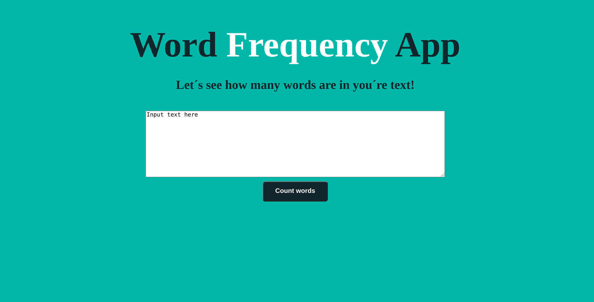

<h1 align="center">Word-frequency-app</h1>
<p>
  
</p>

<br>
<p>

</p>
<br>

> Word Frequency is an app that counts the times each word appears in the submited text and then shows it in a rank.

## Install

```sh
npm install
```

## Usage

```sh
npm run start
```
<br>
<br>

## Author

👤 **Rodrigo Rivera**

- Github: [@reriveram](https://github.com/reriveram)
- LinkedIn: [@rriveram](https://linkedin.com/in/rriveram)

## Show your support

Give a ⭐️ if this project helped you!

---

_This README was generated with ❤️ by [readme-md-generator](https://github.com/kefranabg/readme-md-generator)_
